# Intelligent SCADA System using GenAI 🏭🤖


## Overview

The objective of this project is to design an **Intelligent SCADA System** powered by **Generative AI**, transforming traditional SCADA from a passive monitoring tool into an active, AI-driven decision-support platform for industrial environments.

## The Project Involves

- **ASP.NET Core 8.0 (C#)**: Backend API orchestration, session memory management, and real-time SignalR streaming.
- **Python RAG Service (Flask)**: 7-stage RAG pipeline — intent classification, ChromaDB context retrieval, SQL generation, ML integration, and natural language response synthesis.
- **3-Stage ML Pipeline (TensorFlow / XGBoost / LightGBM)**: Hierarchical anomaly detection and predictive maintenance, trained on a physics-based digital twin built for this project (see [Data & Physics-Based Digital Twin](#data--physics-based-digital-twin) below).
- **Generative AI (Mistral 7B / Groq llama-3.3-70b)**: Natural language understanding, SQL generation, and response narration.
- **ChromaDB**: Vector store populated with database schema and component knowledge for grounded RAG.
- **SignalR**: Real-time live data streaming to the dashboard.
- **iTextSharp & EPPlus**: Automated PDF and Excel report generation from within the chat interface.
- **Chart.js**: Inline data visualizations rendered dynamically in chat responses.

## Live Demo

**🔗 Deployed Application**: [Live Demo](https://swat-dashboard-hlxg.onrender.com/)
> **Note**: The deployed version uses **Groq (llama-3.3-70b-versatile)** as the LLM. The local version used **Mistral 7B Instruct v0.3 (4-bit quantized)** via Ollama, which delivered superior RAG and SQL generation performance due to tighter domain grounding and please be aware that the application may require a few minutes to cold-start upon your first visit.
>
> The live demo cycles through a 480-row sample (roughly 12 minutes at the Plant Sender's current send rate) so a visitor sees NORMAL, ANOMALY, DEGRADING, and FAULT states within one visit instead of waiting through the hours a real degradation episode takes in the full simulation.

## Screenshots

### Live Dashboard
<table>
  <tr>
    <td>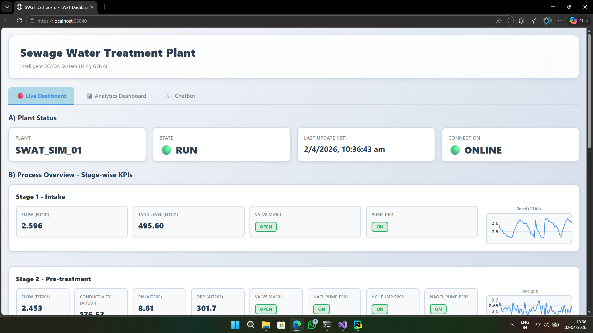</td>
    <td>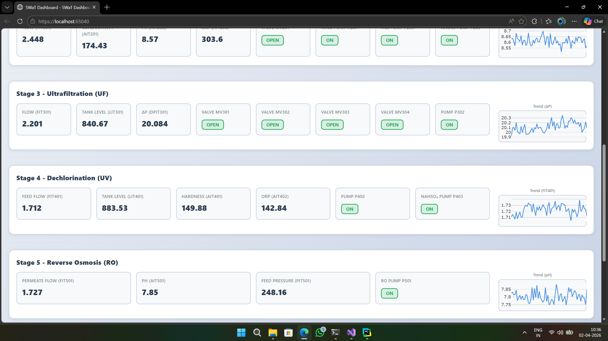</td>
  </tr>
</table>

### Predictive Maintenance
<table>
  <tr>
    <td>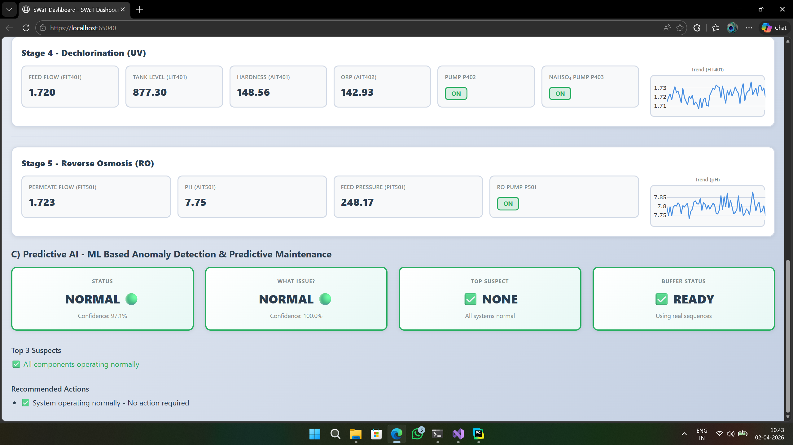</td>
    <td>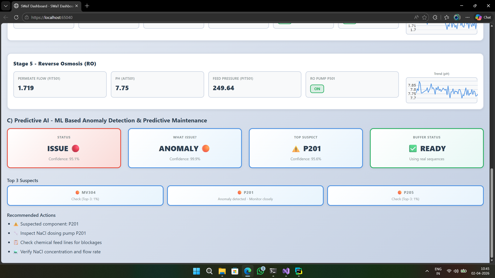</td>
  </tr>
  <tr>
    <td>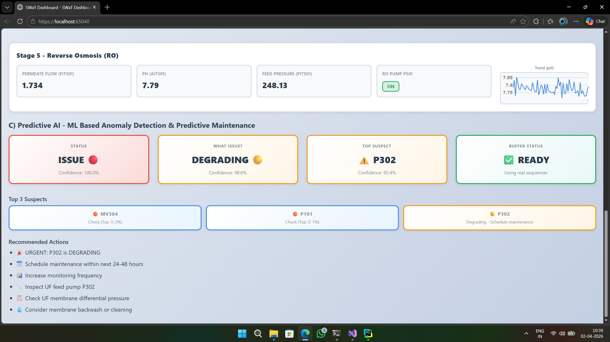</td>
    <td>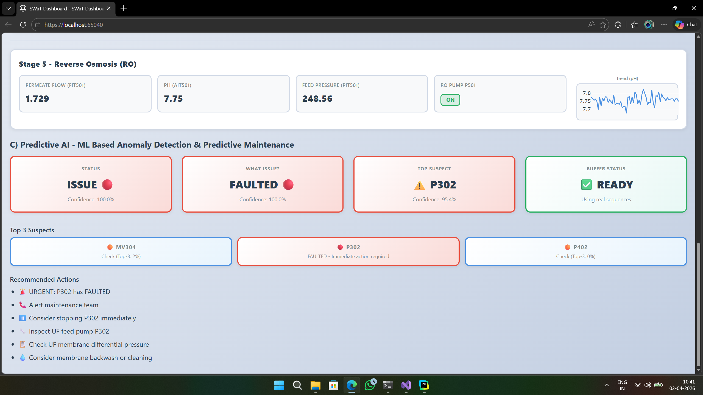</td>
  </tr>
</table>

### Analytics Dashboard
<table>
  <tr>
    <td>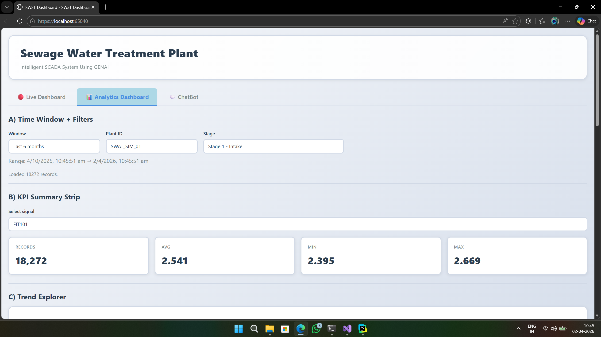</td>
    <td>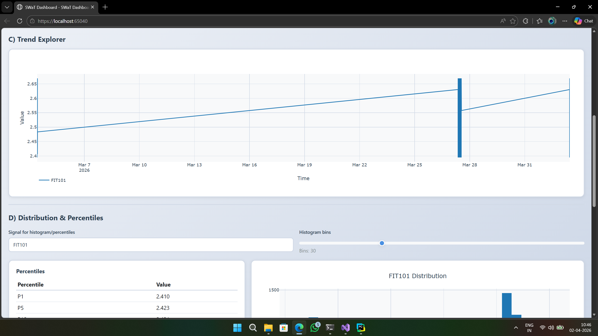</td>
  </tr>
  <tr>
    <td>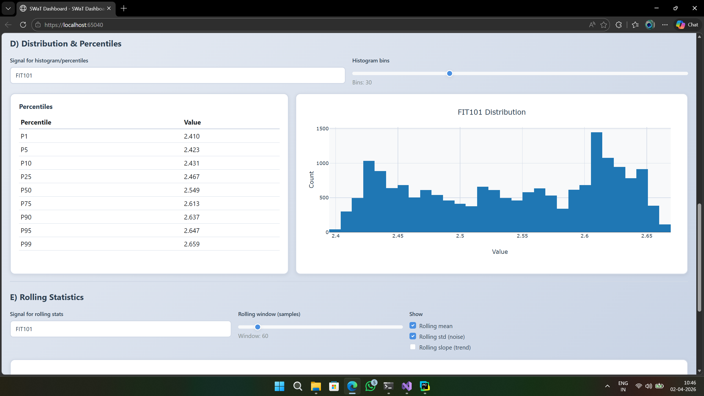</td>
    <td>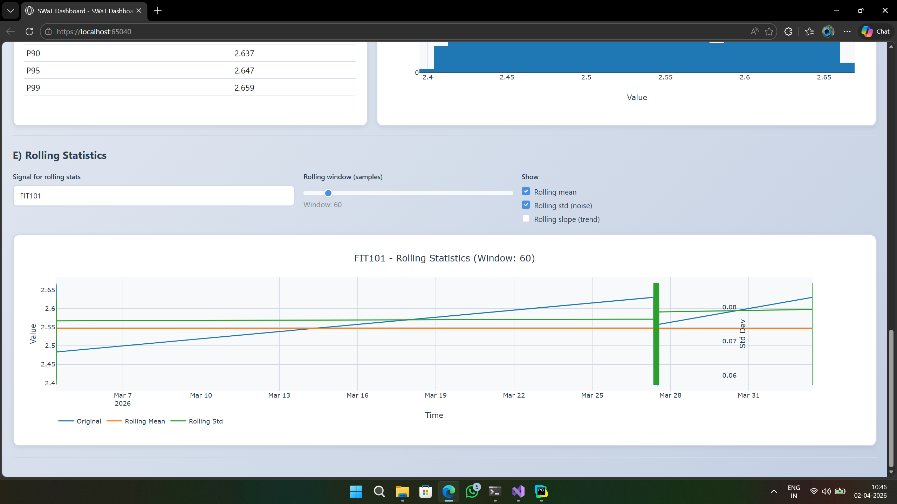</td>
  </tr>
</table>

### AI Chatbot
<table>
  <tr>
    <td>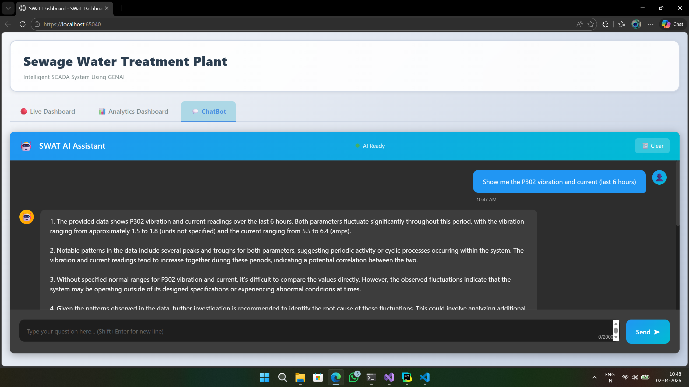</td>
    <td>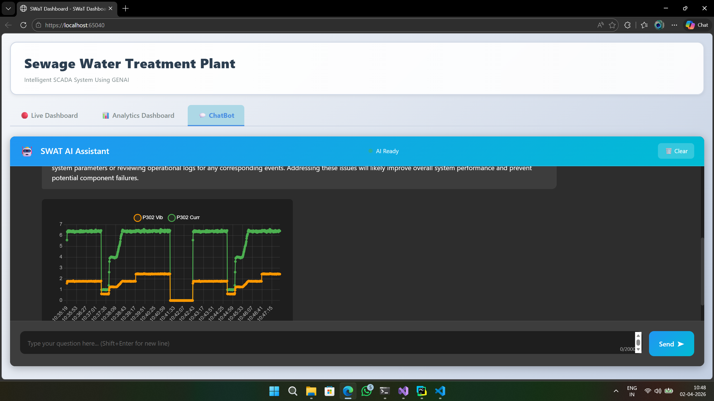</td>
  </tr>
  <tr>
    <td>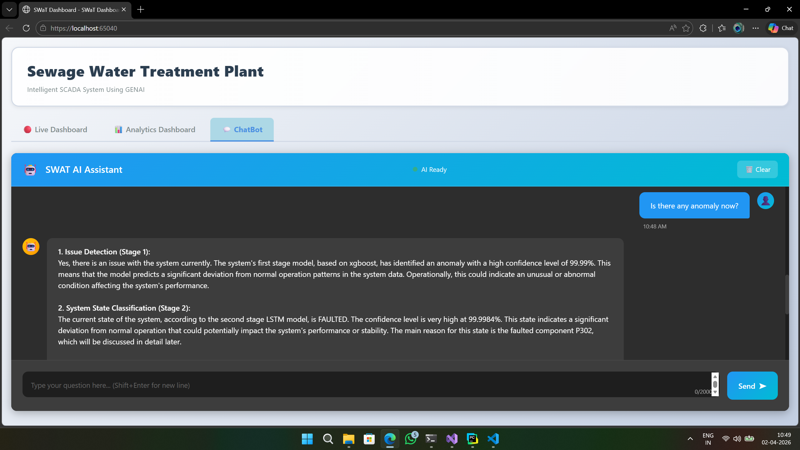</td>
    <td>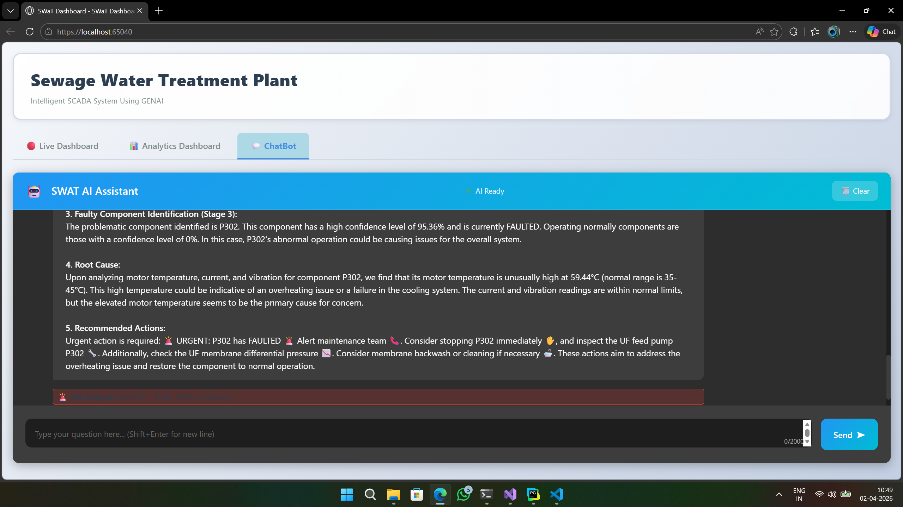</td>
  </tr>
</table>

---

## Overall Architecture


---

## Data & Physics-Based Digital Twin

This digital twin isn't just a training set. It's the data source for the entire running system: the live dashboard, the analytics views, the ML predictions, and the RAG chatbot's answers all trace back to rows this simulator generated. There is no physical plant behind any of it (see [Limitations](#limitations--scope)), the simulator is the plant.

**Source**: [SWaT Dataset, Secure Water Treatment System](https://www.kaggle.com/datasets/vishala28/swat-dataset-secure-water-treatment-system) on Kaggle, real sensor and actuator readings from a scaled-down water treatment testbed, almost entirely normal operation.

**The problem**: that data has close to no faults or anomalies in it. There's nowhere near enough labeled failure data to train a fault classifier, and nothing dynamic enough to drive a live "plant" for a dashboard to monitor.

**What was built instead**: a simulator (`data-simulation/`) that replays the real baseline readings and layers physically grounded degradation, faults, and transient anomalies on top, component by component. Each of the 8 pumps and 2 valves wears down over time, crosses a randomized fault threshold, fails with a realistic sensor and motor signature (temperature, current, vibration), then recovers through a startup phase. A separate process fires short transient anomalies, cavitation, valve chatter, flow oscillation, level jitter, on whatever component happens to be healthy at the time. All of it is grounded in publicly documented water treatment plant behavior, not arbitrary noise.

Two datasets come out of this simulator:
- **Training data**: every component and fault type scheduled to appear a guaranteed number of times, so rare cases aren't left to chance. This is what the 3 ML models are trained on (see [ML Architecture](#ml-architecture)).
- **Simulation data**: the same physics running with realistic, randomly timed behavior, long normal stretches, faults whenever they happen. Held out entirely, never trained on, this is the generalization check reported at every stage of training. A slice of this data is also what the **Plant Sender** replays live into the running application (see [Data Ingestion](#data-ingestion) below), so the same physics that validates the models is what the dashboard, analytics, and chatbot are actually looking at.

Both generated datasets, plus the cleaned baseline, are published on Kaggle: [SWaT Digital Twin: Degradation, Faults and Anomalies](https://www.kaggle.com/datasets/ariadaikalam/fyp-ml-dataset). See `data-simulation/README.md` for how the simulator works and `ml-training/README.md` for how the two datasets turn into the 3 trained models below.

## Data Ingestion

A real SCADA deployment would pull sensor data over MQTT or OPC-UA. This is a portfolio simulation with no physical plant behind it, so those protocols would just be extra plumbing around a value they can't add here. Instead there are two small services, named for what they actually do:

- **Plant Sender**: reads the simulated plant data and posts one row at a time over HTTP, standing in for the field devices.
- **Ingest Service**: receives those rows, does the buffering and batch writes to the database, standing in for a SCADA historian's data collector.

The dashboard, ML service, and RAG service all read from the same database populated by the Ingest Service, the same relationship a real SCADA stack would have between an OPC-UA server and its downstream consumers, just over HTTP instead of an industrial protocol.

## ML Architecture

### The ML pipeline follows a hierarchical 3-stage classification approach:


###  ML Models & Justification of their selection 

| Stage | Models Trained | Selection Metric | Best Model | Test Performance |
|-------|---------------|-----------------|------------|-----------------|
| Stage 1 – Anomaly Detection | Autoencoder (U), Isolation Forest (U), XGBoost (S) | Recall | XGBoost | 87.4% |
| Stage 2 – Fault Classification | XGBoost (S), LSTM (S), 1D CNN (S) | F1-Macro | LSTM | 96.2% |
| Stage 3 – Component Identification | LightGBM (S), MLP (S), XGBoost (S) | Accuracy | XGBoost | 96.3% |

*(S) = Supervised | (U) = Unsupervised*

**Why different metrics per stage?**
- **Recall (Stage 1)**: Can't afford to miss anomalies — it's the first gate.
- **F1-Macro (Stage 2)**: Handles class imbalance across fault types.
- **Accuracy (Stage 3)**: Precise component identification for targeted maintenance.

---

## GenAI ChatBot Architecture


## RAG Pipeline

The conversational interface is powered by a 7-stage RAG pipeline:

| Stage | What Happens |
|-------|-------------|
| 1. Intent Understanding | LLM classifies the NL query — data query, ML prediction, or report request |
| 2. Context Retrieval | ChromaDB vector search retrieves relevant DB schema, component info, and conversation history |
| 3. SQL Generation | LLM generates safe, read-only SQL using retrieved context |
| 4. Data Execution | SQL runs against PostgreSQL; real-time data fetched via SignalR if needed |
| 5. ML Integration | If predictive query — calls 3-stage ML pipeline for health predictions |
| 6. Report Integration | If report request — generates PDF/Excel with actual plant data |
| 7. Response Generation | LLM explains results in natural language + generates Chart.js config for visualizations |

> RAG = Retrieval-Augmented Generation — grounds LLM responses to actual plant data, eliminating hallucination of schema and column names.

---

## Alert System

Confidence-based escalation with smart cooldown and state persistence filtering:

| State | Confidence | 📧 Email | 📱 SMS | 📞 Call |
|-------|-----------|---------|--------|--------|
| NORMAL | — | ❌ | ❌ | ❌ |
| DEGRADING | Any | ✅ | ❌ | ❌ |
| FAULTED | < 90% | ✅ | ✅ | ❌ |
| FAULTED | > 90% | ✅ | ✅ | ✅ |

Each alert includes the affected component, top 3 suspected causes, confidence level, timestamp, and recommended corrective actions.

---

## Key Innovations

- **Physics-based synthetic fault generation** — real SWaT baseline sensor data is replayed and perturbed by a purpose-built digital twin, not sampled or bootstrapped, so failure signatures follow actual pump and valve degradation physics instead of arbitrary noise.
- **Scheduled training data, randomly timed held-out data** — the models train on a dataset where every fault type is guaranteed to appear, then get evaluated against a second, independently generated dataset with realistic random timing they never saw during training. Every reported metric in this README is measured on that held-out set.
- **Hierarchical rather than monolithic fault diagnosis** — anomaly detection, state classification, and component identification are three separate models chained together, not one model trying to answer all three questions at once. Each stage only has to be right at what it's actually good at.
- **ML folded directly into the conversational interface** — predictive maintenance results aren't a separate dashboard tab, the RAG pipeline calls the 3-stage ML pipeline mid-conversation and narrates the result in plain English.
- **Natural language to grounded SQL to plant data** — the chatbot generates real, read-only SQL against the live database rather than answering from a static knowledge base, so it can't hallucinate a sensor reading or a schema that doesn't exist.
- **Confidence-based alert escalation** — DEGRADING and FAULTED states escalate through email, SMS, and phone call differently depending on model confidence, not a flat threshold.
- **SCADA-style real-time architecture, honestly scoped** — SignalR push, a live ingest pipeline, and a historian-style data flow, built to demonstrate the pattern a real SCADA system uses, without claiming a physical plant is connected (see [Limitations](#limitations--scope)).

## Tech Stack

| Layer | Technologies |
|---|---|
| Frontend | ASP.NET Core MVC, Chart.js, SignalR |
| Backend | C#, ASP.NET Core 8, Flask (Python), Docker |
| AI / RAG | Mistral 7B Instruct v0.3 (Ollama) / Groq (Llama 3.3 70B), ChromaDB, retrieval-augmented generation |
| ML | TensorFlow, XGBoost, LightGBM |
| Data | PostgreSQL (Supabase) |
| Reporting | iTextSharp, EPPlus |
| Hosting | Render, Hugging Face Spaces |

## Repository Structure

```
SwatDashboard/                 ASP.NET Core dashboard, SignalR hub, controllers, views
SwatDashboard/PythonMlService/  Flask ML inference API, serves the 3 trained models
SwatDashboard/PythonRagService/ Flask RAG API, ChromaDB, SQL generation, report generation
data-simulation/                Digital twin: generates the training and simulation datasets
ml-training/                    Trains and evaluates the 3-stage ML pipeline on those datasets
```

See `data-simulation/README.md` and `ml-training/README.md` for how to run the simulator and retrain the models from scratch.

## Limitations / Scope

This is a portfolio and research simulation, not a production SCADA deployment. No physical PLCs, sensors, or industrial control network are connected. SWaT provides the baseline process behavior; the degradation, fault, and anomaly scenarios are generated by this project's own digital twin, not observed from a real plant failure.

---

## License

This project is licensed under the MIT License - see the [LICENSE](LICENSE) file for details.

## Contact

For any queries or contributions, feel free to reach out to:

- **Ariharasudhan A** – [Email](mailto:ariadaikalam1234@gmail.com)
- **Harish R** – [Email](mailto:harishsekar2004@gmail.com)
- **Keerthiraj N** – [Email](mailto:keerthirajf39@gmail.com)
